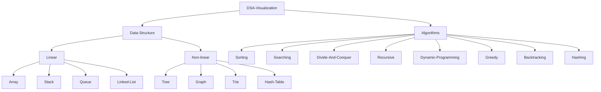

<p align='center' >

</p>

# Data structure and algorithms visualization
> DSA Visualization is a project on **data structures and algorithms**. In this project all points of data structures and algorithms like as working approach, properties, operations, applications, advantages and disadvantages are well explained and visualize the operations for better understanding.

```HTML
Visualization  is the better way to understand of the things
``` 

_If you like this project, please leave me a star._ &#9733;

## Table of Contents


- ### Data Structures
  - **Linear Data Structures**
    - [Array](https://github.com/scottliuu/DSA-visualisation-in-angular/blob/main/src/app/components/NonprimitiveData/linear/arrays/README.md)
    - [Matrix](https://github.com/scottliuu/DSA-visualisation-in-angular/blob/main/src/app/components/NonprimitiveData/linear/arrays/README.md)
    - [Stack](https://github.com/scottliuu/DSA-visualisation-in-angular/blob/main/src/app/components/NonprimitiveData/linear/stack/README.md)
    - [Queue](https://github.com/scottliuu/DSA-visualisation-in-angular/blob/main/src/app/components/NonprimitiveData/linear/queue/README.MD)
    - [Linked List](https://github.com/scottliuu/DSA-visualisation-in-angular/blob/main/src/app/components/NonprimitiveData/linear/linked-list/README.md)
  - **Non-linear Data Structures**
    - [Tree](https://github.com/scottliuu/DSA-visualisation-in-angular/blob/main/src/app/components/NonprimitiveData/non-linear/tree/README.md)
    - [Graph](https://github.com/scottliuu/DSA-visualisation-in-angular/blob/main/src/app/components/NonprimitiveData/non-linear/graph/README.md)
    - [Trie](https://github.com/scottliuu/DSA-visualisation-in-angular/blob/main/src/app/components/NonprimitiveData/non-linear/trie/README.md)
    - [Hash Table](https://github.com/scottliuu/DSA-visualisation-in-angular/blob/main/src/app/components/NonprimitiveData/non-linear/hash-table/README.md)
- ### Algorithms
  - **Sorting**
    - [Selection Sort](https://github.com/scottliuu/DSA-visualisation-in-angular/tree/main/src/app/components/Algorithms/sorting/selection-sort/README.md)
    - [Insertion Sort](https://github.com/scottliuu/DSA-visualisation-in-angular/tree/main/src/app/components/Algorithms/sorting/insertion-sort/README.md)
    - [Merge Sort](https://github.com/scottliuu/DSA-visualisation-in-angular/tree/main/src/app/components/Algorithms/sorting/merge-sort/README.md)
    - Quick Sort
    - Counting Sort
    - Radix Sort
    - Bucket Sort
    - Shell Sort
    - Heap Sort
  - **Searching**
    - Linear Search
    - Binary Search
    - Jump Search
    - Interpolation Search
    - Exponential Search
    - Fibonacci Search
  - **Divide and Conquer**
    - Merge Sort
    - Quick Sort
    - Strassen's Algorithm
    - Closest Pair of Points
    - Karatsuba Algorithm
  - **Recursive**
  - **Dynamic Programming**
  - **Greedy**
  - **Backtracking**
  - **Hashing**
  - **Randomized**

## Contributing
Pull requests are welcome. For major changes, please open an issue first to discuss what you would like to change.
Please read the [Contribute guide](.github/CONTRIBUTING.md)

***Do star, fork and share the repo to show your support, it would help others too!***   <br>
 <br>
 Let me know your views or any changes or improvements or contribute to make better for others 
 
 :heart: ***Thank you all for Forking this repository and contribute***  :heart:


